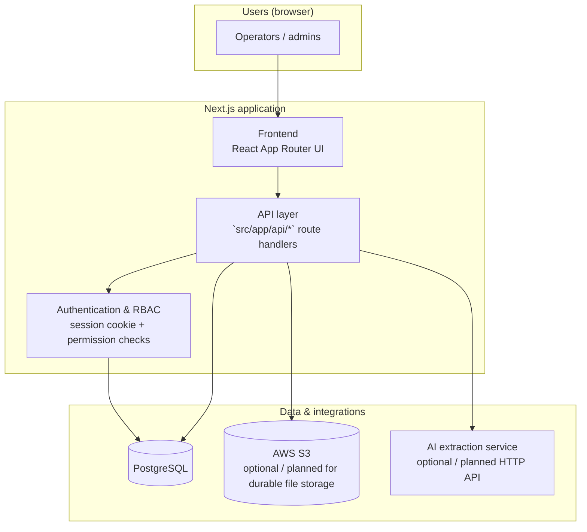
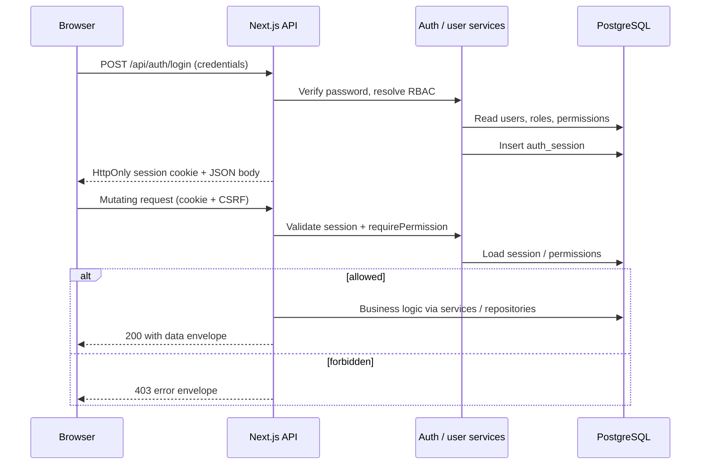
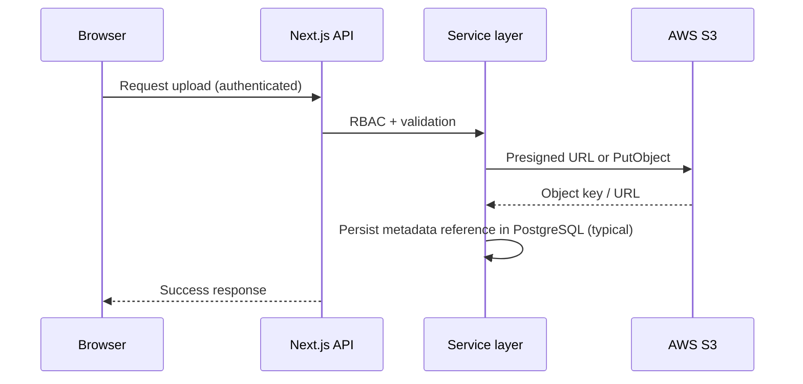
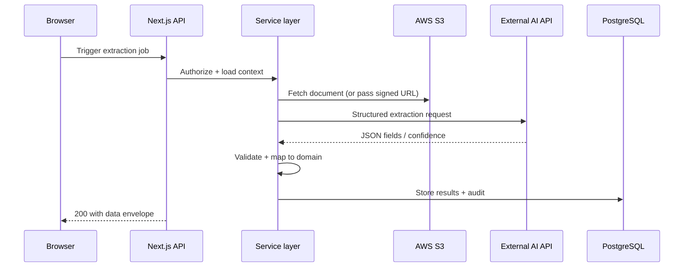

# Architecture (high level)

This document satisfies the assignment requirement for an **architecture diagram**. Render the Mermaid blocks in [GitHub](https://github.blog/news-insights/product-news/github-now-supports-mermaid-diagrams-in-markdown/), [Mermaid Live Editor](https://mermaid.live), or paste into draw.io / Excalidraw / Lucidchart.

## Component diagram

## Authentication flow

## S3 upload (target pattern)

## AI extraction (target pattern)

**Note:** In this repository, **NDIS rate-set Excel** is parsed **in-process** on the API server; **S3** and a separate **AI extraction** service are shown as the intended enterprise extensions required by the assignment brief.
