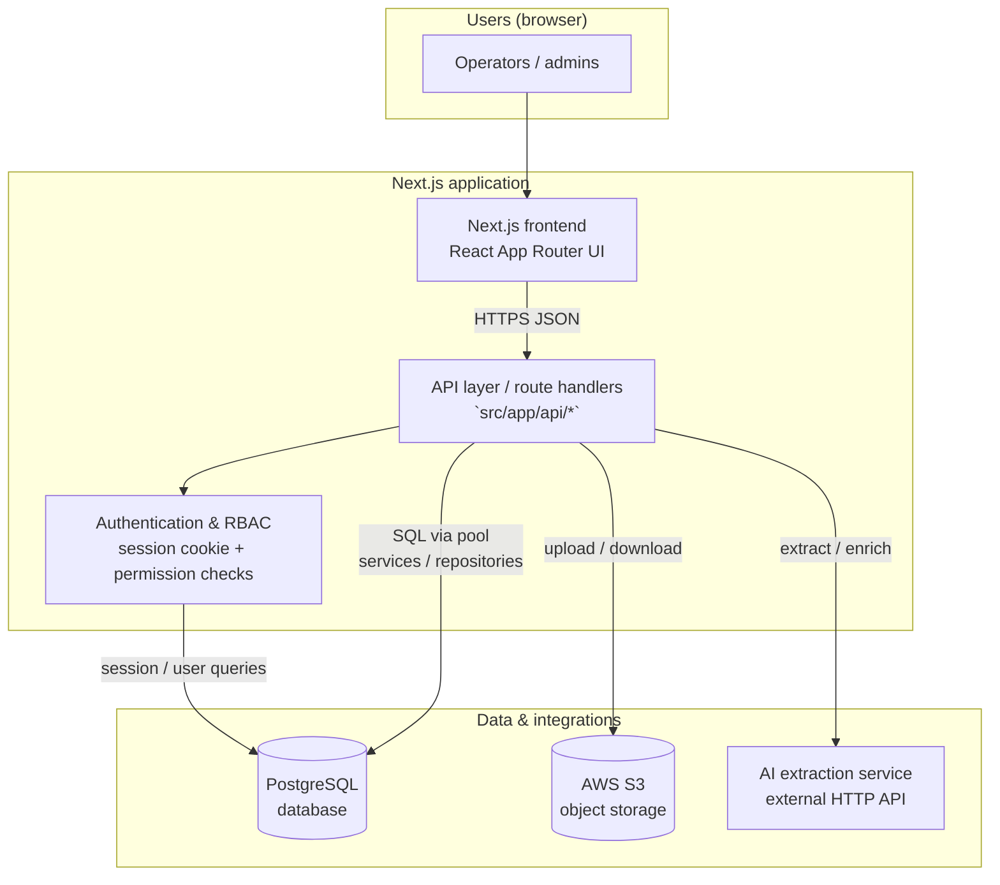
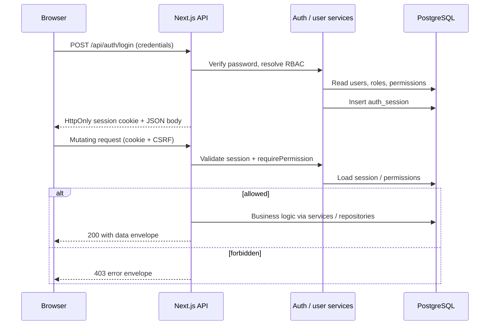
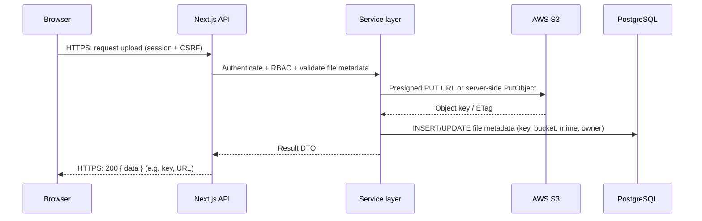
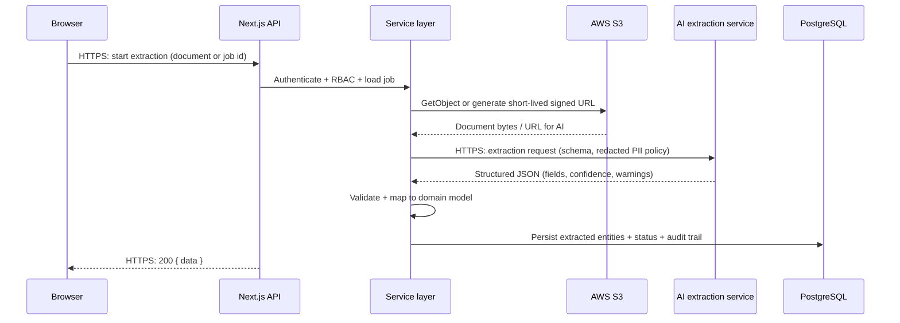

# Architecture (high level)

This document satisfies the **Architecture Design Requirement**: it names all required components and illustrates **Frontend → API**, **API → database**, **authentication / RBAC**, **S3 upload**, and **AI extraction** workflows.

**How to submit:** Render the Mermaid blocks in [GitHub](https://github.blog/news-insights/product-news/github-now-supports-mermaid-diagrams-in-markdown/), [Mermaid Live Editor](https://mermaid.live) (export PNG/SVG/PDF), or recreate in draw.io / Lucidchart / Miro / Excalidraw.

## Rubric mapping (assignment §12)

| Requirement | Where it appears below |
|-------------|-------------------------|
| Next.js frontend application | Component diagram: **Frontend** |
| API layer / backend services | **API** + **Service layer** in sequence diagrams |
| PostgreSQL database | **PostgreSQL** in all diagrams |
| AWS S3 storage | Component diagram + **S3 upload** sequence |
| AI extraction service integration | Component diagram + **AI extraction** sequence |
| Authentication and RBAC layer | **Authentication & RBAC** + **Authentication flow** sequence |
| Frontend → API communication | Component diagram (`HTTPS`); implied in every sequence |
| API → database interactions | Component diagram; sequences show reads/writes |
| Authentication flow | **Authentication flow** sequence |
| S3 upload workflow | **S3 upload** sequence |
| AI extraction workflow | **AI extraction** sequence |

## Component diagram

## Authentication flow

## S3 upload workflow

## AI extraction workflow

### Implementation note (this repository)

**NDIS rate-set Excel** is currently parsed **in-process** on the API server (no separate AI microservice). The **S3** and **AI extraction** diagrams above match the **assignment’s target architecture** (durable storage + external AI); you can label them “logical / planned” in your report if your marker wants strict as-built vs to-be.
